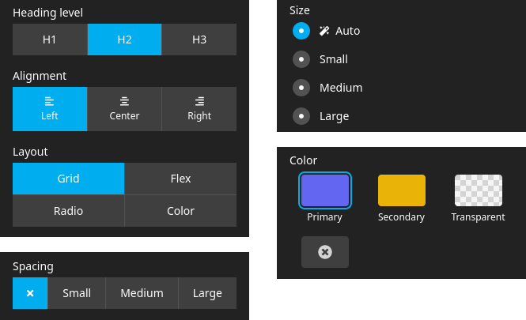

# Toggle Editor for Neos CMS

The toggle editor lets you select one of multiple values. It provides different layout options.



<details>

<summary>Property definitions from the screenshot</summary>

```yaml
properties:
  headingLevel:
    type: string
    ui:
      label: 'Heading level'
      reloadIfChanged: true
      inspector:
        group: 'general'
        editor: 'Beromir.ToggleEditor/Editor'
        editorOptions:
          values:
            h1:
              label: 'H1'
              description: 'Heading level 1'
            h2:
              label: 'H2'
              description: 'Heading level 2'
            h3:
              label: 'H3'
              description: 'Heading level 3'
  alignment:
    type: string
    ui:
      label: 'Alignment'
      reloadIfChanged: true
      inspector:
        group: 'general'
        editor: 'Beromir.ToggleEditor/Editor'
        editorOptions:
          values:
            left:
              label: 'Left'
              icon: 'align-left'
              description: 'Align left'
            center:
              label: 'Center'
              icon: 'align-center'
            right:
              label: 'Right'
              icon: 'align-right'
  layout:
    type: string
    ui:
      label: 'Layout'
      reloadIfChanged: true
      inspector:
        group: 'general'
        editor: 'Beromir.ToggleEditor/Editor'
        editorOptions:
          columns: 2
          values:
            grid:
              label: 'Grid'
            flex:
              label: 'Flex'
            list:
              label: 'Radio'
            color:
              label: 'Color'
  spacing:
    type: string
    ui:
      label: 'Spacing'
      reloadIfChanged: true
      inspector:
        group: 'general'
        editor: 'Beromir.ToggleEditor/Editor'
        editorOptions:
          layout: 'flex'
          values:
            none:
              icon: 'times'
              description: 'No spacing'
            small:
              label: 'Small'
            medium:
              label: 'Medium'
            large:
              label: 'Large'
  size:
    type: string
    defaultValue: 'auto'
    ui:
      label: 'Size'
      reloadIfChanged: true
      inspector:
        group: 'general'
        editor: 'Beromir.ToggleEditor/Editor'
        editorOptions:
          layout: 'list'
          values:
            auto:
              icon: 'magic'
              label: 'Auto'
            small:
              label: 'Small'
            medium:
              label: 'Medium'
            large:
              label: 'Large'
  color:
    type: string
    ui:
      label: 'Color'
      reloadIfChanged: true
      inspector:
        group: 'general'
        editor: 'Beromir.ToggleEditor/Editor'
        editorOptions:
          layout: 'color'
          columns: 3
          values:
            primary:
              color: '#6366f1'
              label: 'Primary'
              description: 'Primary color'
            secondary:
              color: '#eab308'
              label: 'Secondary'
            transparent:
              color: 'transparent'
              label: 'Transparent'
            none:
              color: 'none'
```

</details>

## Installation

Run the following command in your site package:

```
composer require --no-update beromir/neos-toggle-editor
```

Then run `composer update` in your project root.

## Usage

You can select one of the following layout options:

- grid
- flex
- list
- color

If you use the color layout or the grid layout, you can optionally specify the number of columns to render more than one
row.
The color layout is a special case for selecting a color. It renders the color in the editor. You can use `none` and
`transparent` as color values to render these values in a visible way for the editors (see screenshot above).

Add a property of type string to your NodeType definition and use the following editor configuration:

```yaml
properties:
  alignment:
    type: string
    defaultValue: 'left'
    ui:
      label: 'Alignment'
      reloadIfChanged: true
      inspector:
        editor: 'Beromir.ToggleEditor/Editor'
        editorOptions:
          # One of 'grid', 'flex', 'list' or 'color'. Default: 'grid'
          layout: 'flex'
          # Set number of columns to render multiple rows. Works only with 'grid' and 'color'
          columns: 2
          values:
            left:
              # Show a label
              label: 'Left'
              # Show an icon. Does not work with the color layout
              icon: 'align-left'
              # Show a description on hover
              description: 'Align left'
              # Specify the color to display in the editor. Does only work with the color layout
              color: '#ffffff'
            center:
              label: 'Center'
              icon: 'align-center'
            right:
              label: 'Right'
              icon: 'align-right'
```

## Credits

This package is inspired by:

- [Carbon.ColorValues](https://github.com/CarbonPackages/Carbon.ColorValues)
- [Shel.Neos.ColorPicker](https://github.com/Sebobo/Shel.Neos.ColorPicker)
- [Kirby CMS toggles field](https://getkirby.com/docs/reference/panel/fields/toggles)
